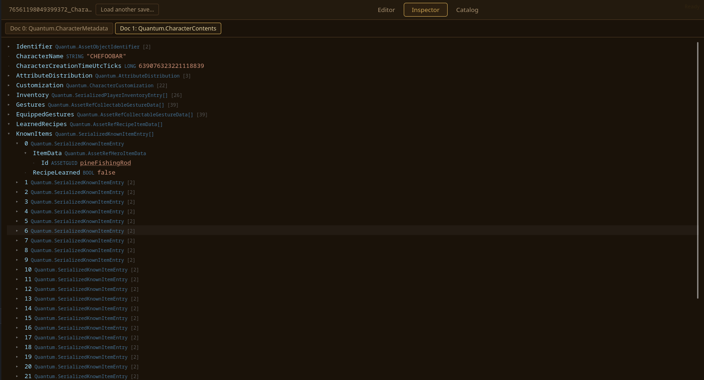
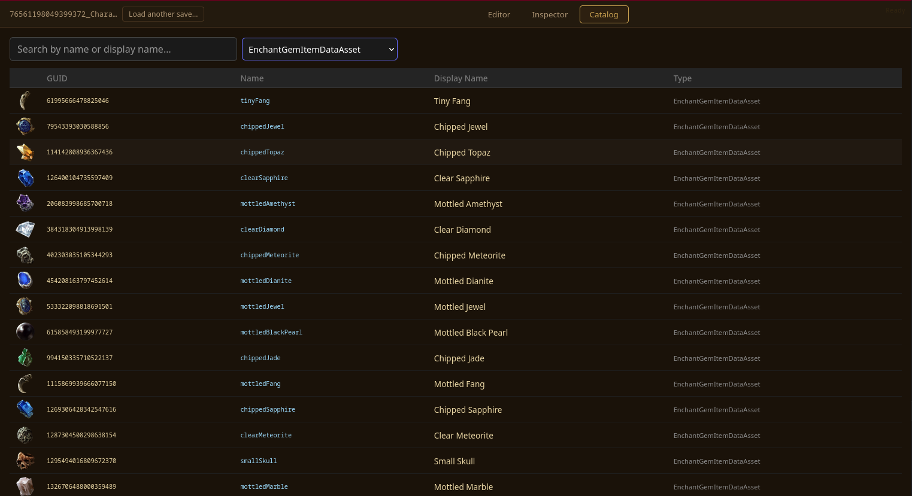

<p align="center"></p>

# No Rest For The Wicked - Save Editor 

This repository hosts the code of a No Rest For The Wicked save data editor.

You can either try to run this yourself via:

`npm run dev`

or, you can use the deployed version at [https://nrftw-edit.suidpit.sh](https://nrftw-edit.suidpit.sh).

It's important to mention that this is a **client-side only app** - it runs entirely in the browser, and your save data is not sent to any backend server. The only reason I deployed it is to ensure non technical people can still use it.

> [!CAUTION]
> Even though I tried baking into the editor many "consistency" limitations (for instance, you cannot apply enchantments meant for armors to weapons), editing your save files is
> an invasive and possibly destructive procedure, and **may definitely break your data**. The game stores `.bak.{number}` copies of your save file in the datastore, so make sure to
> maintain those backup safe and possibly backup yourself the original somewhere in order to restore things in case things go south.

This project was the result of a couple weekends worth of research which I did just for the sake of reverse engineering and experimenting with the game. As such, consider every feature possibly unstable and inconsistent.

With that said, feel free to open an issue here on GitHub in case you find a bug, or you think something should be added and/or changed.

# Why?

No Rest For The Wicked is a really promising game. It pulls you in with the game loop of a Diablo-like, but it keeps you engaged with the deep and satisfying combat of a Souls-like.

The reason I deployed this tool is to give everyone the possibility to easily experiment with new combinations and builds, or just mess around with the game and have fun. It literally doesn't hurt anyone.

With that said, **please do not join co-op games with edited character without consent from other players. It accounts to cheating and, even in a PvE game, it can ruin the experience of other fellow gamers.**

# Editor

This is the main panel of the tool. It provides:

- Stats/attribute edits (leveling up, changing XP, gold, attributes).
- Inventory management. This includes:
  - Creating new items 
  - Editing existing items 
  - Deleting items 
  
There are a few nice-to-have baked in. For instance, when creating equipment (weapons, armors, rings), the editor automatically pre-populates the item with built-in enchantments and runes.


[DEMO IN HERE 📽️](https://youtu.be/KQcXF3q92ms?si=a-DRrrcmVOSfbOLo)

# Inspector

This panel contains a tree with all the nodes parsed from the save data. Does not allow editing, but contains much more information than what it's exposed in the editor, such as NPCs, quests, learned recipes, etc:



# Catalog

In order to enrich the parser data, this tool pulls information from multiple places, such as:

- The Unity asset bundles
- The [https://www.norestforthewicked.gg/](https://www.norestforthewicked.gg/) website
- Secondary files in the game directory

The catalog is a place where, for the sake of debugging, curiosity, and data mining, you can inspect all the parsed assets:



# Architecture & Implementation

These are the main components of the system, in case you want to hack on it:

- In the `wasm/` directory, you'll find a Rust project. This holds the business logic of the save editor. It contains:
  - The `parser/` code, which implements deserialization of CERIMAL (the NRFTW save data format) files.
  - The `dumper.rs` file takes care of serializing back to CERIMAL.
  - The `mutation.rs` file contains schema-aware mutations, used to add inventory items, edit stats, etc. It's schema-aware as it does not implement "schema-agnostic" mutations, but instead it expects a certain structure and logic for the things that made sense to edit.
  - The `lib.rs` contains the WASM API that is exposed to the web application.
- The `src/` directory contains the code of the Svelte web application. This is the Web UI.
- The `public/catalog.db` is the SQLITE db that is used by the editor to "know" what objects can be created, what is their description, their effect, etc.
- The `scripts/` directory contains the scripts used to generate the `public/catalog.db` file. See the section below on regenerating the catalog.

**A lot of the actual implementation was generated via AI-assisted coding.** While I guided the project, avoiding to follow the "vibe" to hold control, I am not 100% satisfied by the quality/readability of the code
and you might agree with me. Nevertheless, there are quite some tests of the end-to-end editor use cases, so this makes me feel more comfortable about the reliability of the tool.

## Notes on the cerimal format

The `docs/cerimal_binary.md` file contains some notes on the reverse-engineering of the CERIMAL format. They're not polished.

## Regenerating the catalog

The catalog (`public/catalog.db`) and unique-item presets (`src/lib/data/all_unique_item_enchantments.json`) are generated from the game's Unity asset bundles and should be regenerated after game updates.

The scripts expect the data directory of the game to be linked at `dataDir` in the repo root (e.g. via  `ln -s  ~/.local/share/Steam/steamapps/common/NoRestForTheWicked/NoRestForTheWicked_Data dataDir`).

To regenerate everything, please run:

```bash
uv run --script scripts/regenerate_static_assets.py
```

This orchestrates three steps:

1. **Extract assets** from Unity bundles into `public/catalog.raw.db` (via `bundle_catalog.py`). This step produces raw data that only maps AssetGUIDs to a display name and a type.
2. **Enrich with site data** from [norestforthewicked.gg](https://www.norestforthewicked.gg/) to produce `public/catalog.db` (via `build_catalog_v2.py`). Fetched pages are cached in `cache/catalog-v2/` — delete that directory to force a fresh scrape, but it can be useful to avoid re-scraping for quick modifications.
3. **Generate unique-item presets** mapping legendary items to their built-in enchantments (via `generate_unique_item_presets.py`).

Useful flags:
- `--offline-site-cache` — skip network requests, use only cached site pages
- `--with-wasm` — also rebuild the Rust WASM module in `src/wasm-pkg/`

> **After a game update:** bundle filenames contain content hashes that change between versions. You should update hashes in the bundle filenames in `bundle_catalog.py`, `generate_unique_item_presets.py`, and `regenerate_static_assets.py`.

# Troubleshooting & Known Limitations

## "Failed to load your save"

If you encounter an error with the text "Failed to load your save", that is either:

- (very likely) a bug in the parser code
- (unlikely) the game running consistency checks

In that case, you can just grab the latest 100 or so lines from the `%AppData%/LocalLow/Moon Studios/NoRestForTheWicked/Player.log` file and share them in an GitHub issue.
This way, even without your save data, I may be able to trace down what's happening.

## There is a conflict in your save

The game backups save data in the cloud, and may realise that something is wrong when you edit the character. The solution for this is simple: just pick the local version of the save when asked.

## Created/edited items disappearing from your inventory...

The game handles some edge cases by removing altogether the culprit items. This is the case, for instance, with items that have too many enchantments.

## ...attributes not respencting your edits...

There are certain checks with attributes that I've not bothered to reverse yet. Long story short, it really does not make sense to directly edit attributes (yet), as the checks will "normalize" attributes
as soon as something weird is detected. Please feel free to play around with the editor to dynamically find out the logic, or just increase your level to gain stats point to spend.

## ...or, more in general, weird situations

By cross-referencing multiple sources of information, the editor does its best to maintain a certain level of consistency, so to limit "nonsense" operations.
Nevertheless, there are probably infinite ways in which you can create items or sets of stats that do not make sense for the game, possibly breaking some functionality.

Nevertheless, this is the beauty of editing: just experiment, move things around, and see what happens!
